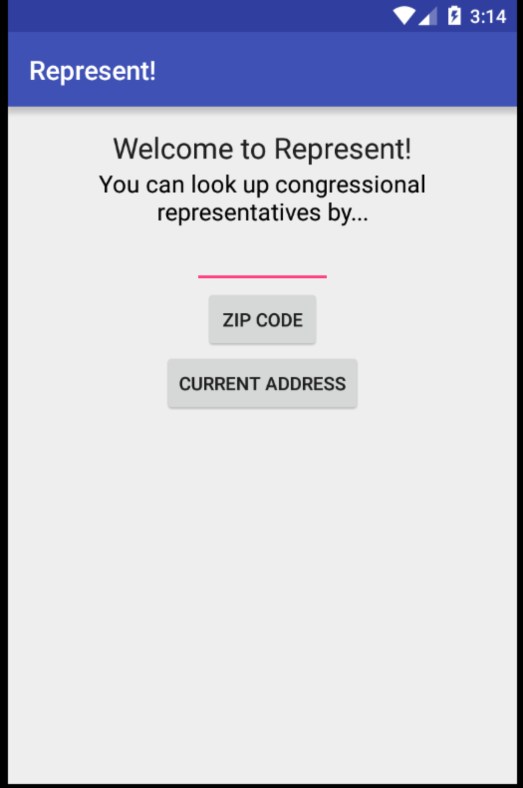
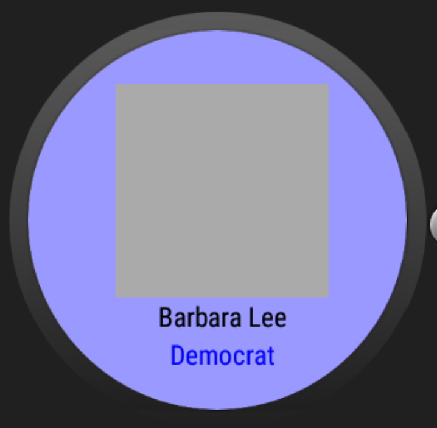
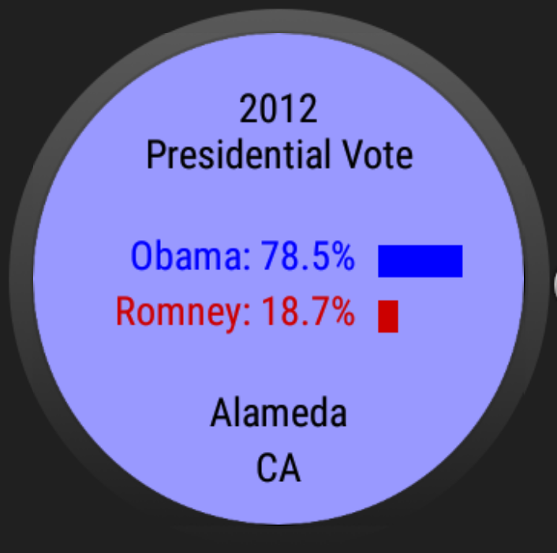

# PROG 02: Represent!

An app that allows users to look up representative or senator information by area.

## Authors

Chien Ting (Joseph) Chiang ([josephchiang28@berkeley.edu](mailto:your_email@berkeley.edu))

## Demo Video

https://youtu.be/nqbh6ErBHqk

## Screenshots

## Acknowledgments

List of APIs used
* Google Location
* Google Geocoding
* Twitter
* Sunlight Foundation API
